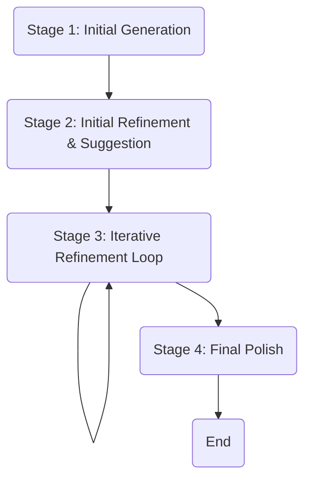
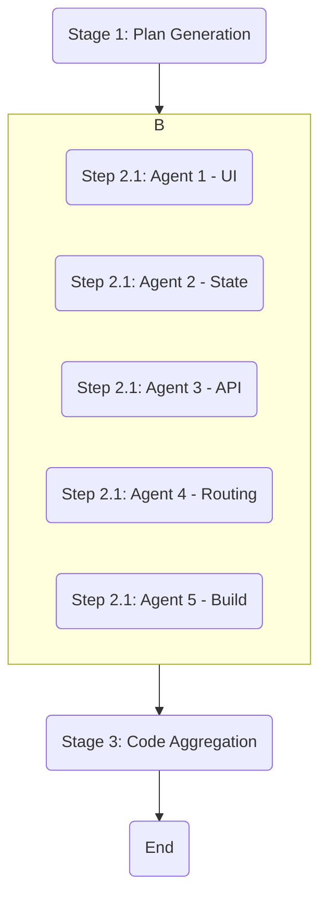
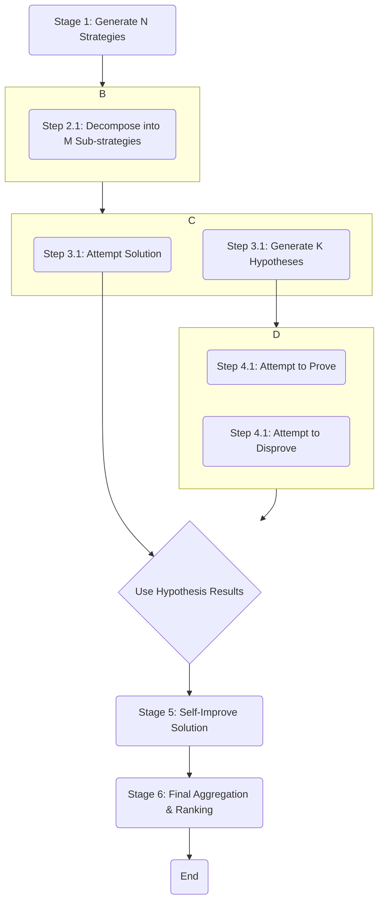

# 多智能体协同工作流架构设计

本文档旨在设计一个强大、灵活且可扩展的架构，用于支持多种多智能体（Multi-Agent）并行和迭代协同的工作流。该架构旨在取代现有系统的硬编码逻辑，提供一个更加模块化和可配置的解决方案。

## 1. 核心理念

我们的核心理念是**“一切皆为工作流” (Everything is a Workflow)**。用户的任何请求，无论是生成代码、撰写文章还是解决复杂的数学问题，都将被映射到一个预定义或动态生成的工作流上。

这个工作流由一系列**阶段 (Stages)** 组成，每个阶段包含一个或多个并行的**步骤 (Steps)**，而每个步骤则由一个**智能体 (Agent)** 来执行一个具体的**任务 (Task)**。

## 2. 架构组件

新架构将由以下几个核心组件构成：

*   **工作流引擎 (Workflow Engine)**
*   **工作流定义 (Workflow Definitions)**
*   **智能体池 (Agent Pool)**
*   **工具箱 (Toolbox)**
*   **状态管理器 (State Manager)**
*   **前端用户界面 (Frontend UI)**

---
*（后续部分将详细阐述每个组件的设计...）*

---

## 3. 核心概念与数据结构

为了实现模块化和可配置性，我们定义以下核心数据结构：

*   **`Context`**: 一个全局上下文对象，包含用户初始请求、所有 Agent 的历史输出、共享文件、API 密钥等。它在整个工作流执行期间持续存在并被所有 Agent 访问。
*   **`Model`**: 一个可用的 AI 模型，定义了其 `model_id`、提供商和 API 配置。
*   **`Role`**: 工作流中定义的一个角色，包含其 `role_id` 和 `system_prompt`。
*   **`Agent`**: 一个**动态的、在运行时创建的**实体。它由一个 `Role`（提供 `system_prompt`）和一个 `Model`（提供“大脑”）组合而成。
*   **`Task`**: 一个原子性的工作单元。它定义了要由哪个 `Role` 来执行，以及生成 `user_prompt` 的模板。
*   **`Step`**: 工作流中的一个执行步骤。它包含一个或多个 `Task`。如果一个 `Step` 包含多个 `Task`，这些任务将**并行执行**。
*   **`Stage`**: 工作流中的一个阶段。它包含一个或多个 `Step`。如果一个 `Stage` 包含多个 `Step`，这些步骤将**串行执行**，前一个 `Step` 的输出将作为后一个 `Step` 的输入。
*   **`Workflow`**: 整个工作流的定义。它包含一个 `id`、`name` 和一个有序的 `Stage` 列表。

## 4. 工作流引擎 (Workflow Engine)

工作流引擎是整个系统的核心协调器。它的主要职责是解析和执行工作流定义。

### 4.1. 引擎架构

引擎的内部结构可以用下面的 Mermaid 图来表示：

```mermaid
graph TD
    subgraph WorkflowEngine
        A[1. Load Workflow Definition] --> B{2. Initialize Context};
        B --> C[3. Get Next Stage];
        C --> D{4. Stage Exists?};
        D -- Yes --> E[5. Get Next Step];
        D -- No --> K[11. End Workflow];
        E --> F{6. Step Exists?};
        F -- Yes --> G[7. Execute All Tasks in Step (Parallel)];
        F -- No --> C;
        G --> H{8. All Tasks Complete?};
        H -- Yes --> I[9. Aggregate Outputs];
        H -- No --> G;
        I --> J{10. Update Context};
        J --> E;
    end

    subgraph ExternalComponents
        WD[Workflow Definition] --> A;
        CTX_IN[Initial User Request] --> B;
        AP[Agent Pool] --> G;
        CTX_OUT[Final Output] --> K;
    end
```

### 4.2. 执行流程

1.  **加载工作流定义**: 引擎加载一个 `Workflow` 定义文件。
2.  **（新）获取角色分配**: UI 会解析工作流中的 `roles` 列表，并让用户为每个 `role` 指派一个具体的 `agent_id`。这个映射关系（`roleAssignments`）将被创建。
3.  **初始化上下文**: 引擎创建一个全局 `Context` 对象，并将用户的初始请求放入其中。
4.  **遍历阶段 (Stages)**: 引擎开始按顺序遍历 `Workflow` 中的每个 `Stage`。
5.  **遍历步骤 (Steps)**: 在每个 `Stage` 内部，引擎按顺序遍历每个 `Step`。
6.  **并行执行任务 (Tasks)**: 在每个 `Step` 内部，引擎获取所有的 `Task`。对于每个 `Task`：
    a.  它读取 `task.role` (例如, "agent-generator")。
    b.  它使用 `roleAssignments` 映射来查找该角色被指派给了哪个 `agent_id`。
    c.  它从 `智能体池 (Agent Pool)` 中获取对应的 `Agent` 实例。
    d.  所有任务被**同时**分发执行。
7.  **等待与聚合**: 引擎等待当前 `Step` 中的所有 `Task` 执行完毕，然后将所有并行的输出聚合起来。
8.  **更新上下文**: 聚合后的输出被更新到全局 `Context` 中，使其对后续的 `Step` 和 `Stage` 可见。
9.  **循环**: 引擎继续执行下一个 `Step`，然后是下一个 `Stage`，直到所有阶段都执行完毕。
10. **结束**: 工作流执行结束，最终的 `Context` 内容被呈现给用户。

---

## 5. 工作流定义 (Workflow Definitions)

工作流定义是描述一个完整任务流程的蓝图。它们将以独立的 `JSON` 或 `YAML` 文件形式存在，使得添加、修改或组合工作流变得非常容易。

下面，我们将展示如何将旧系统中的三种核心模式重构为这种新的定义格式。

### 5.1. 模式一: 通用迭代精炼工作流 (`iterative-refinement.workflow.json`)

这个工作流对应旧系统中的 `Agent` 模式，可以处理任意用户请求。它的核心是一个“生成 -> 改进 -> 建议 -> 实现”的循环。

**结构图:**



**定义示例 (`JSON`):**

```json
{
  "id": "wf-iterative-refinement",
  "name": "通用迭代精炼工作流",
  "roles": [
    {
      "role_id": "generator",
      "description": "负责根据用户请求生成初始内容。",
      "system_prompt": "You are an expert content generator. Your task is to create a high-quality initial draft based on the user's request."
    },
    {
      "role_id": "refiner_suggester",
      "description": "负责改进内容并提出下一步建议。",
      "system_prompt": "You are a critical editor. Your task is to refine the given content and provide specific, actionable suggestions for improvement."
    },
    {
      "role_id": "implementer",
      "description": "负责将建议实现到内容中。",
      "system_prompt": "You are a diligent assistant. Your task is to implement the given suggestions into the provided content accurately."
    },
    {
      "role_id": "polisher",
      "description": "负责对最终内容进行全面的润色和修正。",
      "system_prompt": "You are a final editor. Your task is to perform a final, comprehensive polish of the content, correcting any remaining errors and improving its overall quality."
    }
  ],
  "stages": [
    {
      "id": "stage-1-initial-gen",
      "name": "初始生成",
      "steps": [
        {
          "id": "step-1.1-gen",
          "tasks": [
            {
              "id": "task-1.1.1-gen",
              "role": "generator",
              "prompt_template": "根据用户请求 '{{context.initial_request}}'，生成初始内容。"
            }
          ]
        }
      ]
    },
    {
      "id": "stage-2-refine-suggest",
      "name": "初次精炼与建议",
      "steps": [
        {
          "id": "step-2.1-refine-suggest",
          "tasks": [
            {
              "id": "task-2.1.1-refine-suggest",
              "role": "refiner_suggester",
              "prompt_template": "对以下内容 '{{context.stages['stage-1-initial-gen'].output}}' 进行改进，并提出两点下一步建议。以JSON格式返回 {\"refined_content\": \"...\", \"suggestions\": [\"...\", \"...\"]}。"
            }
          ]
        }
      ]
    },
    {
      "id": "stage-3-loop",
      "name": "迭代精炼循环",
      "loop_count": 3, // 循环次数
      "steps": [
        {
          "id": "step-3.1-implement",
          "name": "实现建议",
          "tasks": [
            {
              "id": "task-3.1.1-implement",
              "role": "implementer",
              "prompt_template": "将建议 '{{context.stages['stage-2-refine-suggest'].output.suggestions}}' 实现到内容 '{{context.stages['stage-2-refine-suggest'].output.refined_content}}' 中。"
            }
          ]
        },
        {
          "id": "step-3.2-refine-suggest-again",
          "name": "再次精炼与建议",
          "tasks": [
            {
              "id": "task-3.2.1-refine-suggest-again",
              "role": "refiner_suggester", // 复用同一个角色
              "prompt_template": "对以下内容 '{{context.stages['stage-3-loop'].steps['step-3.1-implement'].output}}' 进行改进，并提出两点新的建议。以JSON格式返回 {\"refined_content\": \"...\", \"suggestions\": [\"...\", \"...\"]}。"
            }
          ]
        }
      ]
    },
    {
      "id": "stage-4-final-polish",
      "name": "最终润色",
      "steps": [
        {
          "id": "step-4.1-polish",
          "tasks": [
            {
              "id": "task-4.1.1-polish",
              "role": "polisher",
              "prompt_template": "对最终内容 '{{context.stages['stage-3-loop'].output.refined_content}}' 进行最后的、全面的润色和修正。"
            }
          ]
        }
      ]
    }
  ]
}
```

### 5.2. 模式二: 并行代码生成工作流 (`parallel-coding.workflow.json`)

这个工作流对应旧系统中的 `React` 模式，用于并行开发一个软件项目。

**结构图:**



**定义示例 (`JSON`):**

```json
{
  "id": "wf-parallel-coding",
  "name": "并行代码生成工作流",
  "roles": [
    { "role_id": "architect", "description": "生成高层次的开发计划。", "system_prompt": "You are a software architect. Create a detailed development plan."},
    { "role_id": "coder-ui", "description": "负责实现用户界面。", "system_prompt": "You are a frontend developer. Implement the UI according to the plan."},
    { "role_id": "coder-state", "description": "负责实现状态管理。", "system_prompt": "You are a frontend developer. Implement the state management according to the plan."},
    { "role_id": "coder-api", "description": "负责实现 API 交互。", "system_prompt": "You are a backend developer. Implement the API interactions according to the plan."},
    { "role_id": "coder-routing", "description": "负责实现路由。", "system_prompt": "You are a frontend developer. Implement the routing according to the plan."},
    { "role_id": "coder-build", "description": "负责实现构建配置。", "system_prompt": "You are a DevOps engineer. Implement the build configuration according to the plan."},
    { "role_id": "aggregator", "description": "聚合所有代码。", "system_prompt": "You are a script. Aggregate all code files."}
  ],
  "stages": [
    {
      "id": "stage-1-planning",
      "name": "规划生成",
      "steps": [
        {
          "id": "step-1.1-plan",
          "tasks": [
            {
              "id": "task-1.1.1-plan",
              "role": "architect",
              "prompt_template": "根据用户请求 '{{context.initial_request}}'，生成一个详细的、分发给5个并行角色的开发计划 `plan.txt`。"
            }
          ]
        }
      ]
    },
    {
      "id": "stage-2-parallel-dev",
      "name": "并行开发",
      "steps": [
        {
          "id": "step-2.1-all-agents",
          "tasks": [
            { "id": "task-2.1.1-agent1-ui", "role": "coder-ui", "prompt_template": "这是开发计划: '{{context.stages['stage-1-planning'].output}}'。执行你作为UI Coder的任务。" },
            { "id": "task-2.1.2-agent2-state", "role": "coder-state", "prompt_template": "这是开发计划: '{{context.stages['stage-1-planning'].output}}'。执行你作为State Coder的任务。" },
            { "id": "task-2.1.3-agent3-api", "role": "coder-api", "prompt_template": "这是开发计划: '{{context.stages['stage-1-planning'].output}}'。执行你作为API Coder的任务。" },
            { "id": "task-2.1.4-agent4-routing", "role": "coder-routing", "prompt_template": "这是开发计划: '{{context.stages['stage-1-planning'].output}}'。执行你作为Routing Coder的任务。" },
            { "id": "task-2.1.5-agent5-build", "role": "coder-build", "prompt_template": "这是开发计划: '{{context.stages['stage-1-planning'].output}}'。执行你作为Build Coder的任务。" }
          ]
        }
      ]
    },
    {
      "id": "stage-3-aggregation",
      "name": "代码聚合",
      "steps": [
        {
          "id": "step-3.1-aggregate",
          "tasks": [
            {
              "id": "task-3.1.1-aggregate",
              "role": "aggregator",
              "prompt_template": "将 '{{context.stages['stage-2-parallel-dev'].output}}' 中的所有代码片段根据文件名聚合到对应的文件中。"
            }
          ]
        }
      ]
    }
  ]
}
```

---

## 6. 智能体池 (Agent Pool) 与工具箱 (Toolbox)

为了支持“多 AI 协同”并赋予 Agent 更强大的能力，我们需要一个灵活的智能体和工具管理系统。

### 6.1. 智能体池 (Agent Pool) - 动态 Agent 生成器

`Agent Pool` 的角色从一个简单的注册表，演变为一个**动态 Agent 的工厂和缓存**。

*   **核心方法**: `getAgent(role: WorkflowRole, model: ModelDefinition)`
*   **流程**:
    1.  当工作流引擎需要一个 Agent 来执行任务时，它会向 `Agent Pool` 请求一个具有特定 `role` 和 `model` 的 Agent。
    2.  `Agent Pool` 首先检查其内部缓存，看是否已经存在一个由这个 `role` 和 `model` 组合而成的 Agent 实例。
    3.  如果存在，则直接返回缓存的实例。
    4.  如果不存在，`Agent Pool` 将：
        a.  提取 `role.system_prompt`。
        b.  提取 `model` 的所有配置（提供商、API URL 等）。
        c.  使用这些信息，`new` 一个新的 `GeminiAgent` 或 `OpenAICompatibleAgent` 实例。
        d.  将这个新创建的实例存入缓存。
        e.  返回这个新实例。
*   **优势**: 这种方法极大地提高了灵活性。我们不再需要预先定义每一个 Agent。任何 `role` 都可以与任何可用的 `model` 动态组合，从而真正实现了用户为“部门”选择不同“大脑”的愿景。

### 6.2. 工具箱 (Toolbox)

`Toolbox` 为 Agent 提供了与外部世界交互的能力。

*   **工具定义**: 每个工具都是一个独立的函数或模块，具有明确的输入和输出。例如：
    *   `readFile(path)`
    *   `writeFile(path, content)`
    *   `executeCommand(command)`
    *   `searchWeb(query)`
*   **工具授权**: 在 `Agent` 的定义中，我们可以明确授权该 Agent 可以使用哪些工具。这提供了一个安全沙箱，防止 Agent 执行未经授权的操作。
*   **工具使用**: 当 Agent 的输出符合特定的工具调用格式（例如，Function Calling 的 JSON 格式），工作流引擎会拦截该输出，执行相应的工具，并将工具的返回结果作为新的上下文提供给 Agent，让其继续执行。

## 7. 状态管理器 (State Manager)

`State Manager` 负责跟踪整个工作流的实时状态。它将使用类似 Redux 或 Zustand 的模式，维护一个全局状态树，包含：

*   `current_workflow_id`: 当前正在执行的工作流 ID。
*   `status`: 工作流的总体状态 (`running`, `paused`, `completed`, `failed`)。
*   `context`: 完整的全局上下文对象。
*   `progress`: 一个详细的树状结构，实时记录每个 `Stage`, `Step`, 和 `Task` 的状态 (`pending`, `running`, `completed`, `failed`)、开始/结束时间、以及各自的输出或错误信息。

这个状态管理器将是前端 UI 实时展示进度的核心数据源。

## 8. 前端用户界面 (Frontend UI)

新的 UI 将围绕工作流的概念进行重新设计。

*   **工作流选择器**: 用户可以从一个列表中选择一个预定义的工作流（如“通用迭代精炼”、“并行代码生成”）。对于高级用例，用户甚至可以上传自定义的工作流定义文件。
*   **启动表单**: 用户输入初始请求（例如，"帮我写一个贪吃蛇游戏"），并可以选择性地调整工作流的一些高级参数（如循环次数）。
*   **实时进度视图**: 这是 UI 的核心。它将订阅 `State Manager` 的数据，并以图形化方式实时展示工作流的执行进度。
    *   使用类似看板或流程图的布局，清晰地展示每个 `Stage` 和 `Step`。
    *   每个 `Task` 将显示为一个卡片，包含其 `agent_id`、状态、以及最新的输出摘要。
    *   用户可以点击任何一个 `Task` 卡片来查看完整的输入（prompt）和输出（response）。
*   **交互式控制**: 用户将拥有控制正在执行的工作流的能力，包括“暂停”、“恢复”和“停止”按钮。

这个新架构将为我们提供一个极其强大和灵活的平台，以应对未来更多、更复杂的 AI 协同挑战。

### 5.3. 模式三: 对抗性数学推理工作流 (`adversarial-math.workflow.json`)

这个工作流对应旧系统中最复杂的 `Math` 模式，结合了策略、战术、并行证明/证伪和迭代求解。

**结构图:**



**定义示例 (`JSON`):**

这个工作流的定义会非常复杂，因为它涉及到嵌套循环和条件逻辑。这凸显了我们的工作流引擎需要支持更高级的控制流（如 `for-each` 循环）的能力。

```json
{
  "id": "wf-adversarial-math",
  "name": "对抗性数学推理工作流",
  "roles": [
      { "role_id": "strategist", "description": "生成宏观策略", "system_prompt": "You are a math strategist. Generate N different strategies to solve the problem."},
      { "role_id": "tactician", "description": "分解为战术", "system_prompt": "You are a math tactician. Decompose the given strategy into M different tactics."},
      { "role_id": "solver", "description": "并行求解", "system_prompt": "You are a math solver. Try to solve the problem based on the given tactic."},
      { "role_id": "conjecturer", "description": "提出假设", "system_prompt": "You are a math conjecturer. Propose K key hypotheses based on the problem."},
      { "role_id": "prover", "description": "证明假设", "system_prompt": "You are a math prover. Try to prove the given hypothesis."},
      { "role_id": "disprover", "description": "证伪假设", "system_prompt": "You are a math disprover. Try to disprove the given hypothesis."},
      { "role_id": "improver", "description": "整合与自我改进", "system_prompt": "You are a math improver. Combine the results and improve the final solution."}
  ],
  "stages": [
    {
      "id": "stage-1-strategies",
      "name": "生成宏观策略",
      "steps": [ { "id": "step-1.1-gen-strategies", "tasks": [ { "id": "task-1.1.1-gen-strategies", "role": "strategist", "prompt_template": "为问题 '{{context.initial_request}}' 生成 {{N}} 个不同的解题策略。" } ] } ]
    },
    {
      "id": "stage-2-decompose",
      "name": "分解为战术",
      "for_each": "strategy in context.stages['stage-1-strategies'].output.strategies",
      "steps": [ { "id": "step-2.1-gen-sub-strategies", "tasks": [ { "id": "task-2.1.1-gen-sub-strategies", "role": "tactician", "prompt_template": "将策略 '{{strategy}}' 分解为 {{M}} 个不同的战术。" } ] } ]
    },
    {
      "id": "stage-3-solve-and-hypothesize",
      "name": "并行求解与假设",
      "for_each": "sub_strategy in context.stages['stage-2-decompose'].output.sub_strategies",
      "steps": [ { "id": "step-3.1-parallel-tasks", "tasks": [ { "id": "task-3.1.1-solve", "role": "solver", "prompt_template": "尝试根据战术 '{{sub_strategy}}' 解决问题。" }, { "id": "task-3.1.2-hypothesize", "role": "conjecturer", "prompt_template": "根据问题 '{{context.initial_request}}' 提出 {{K}} 个关键假设。" } ] } ]
    },
    {
      "id": "stage-4-adversarial-check",
      "name": "对抗性检验假设",
      "for_each": "hypothesis in context.stages['stage-3-solve-and-hypothesize'].output.hypotheses",
      "steps": [ { "id": "step-4.1-prove-disprove", "tasks": [ { "id": "task-4.1.1-prove", "role": "prover", "prompt_template": "尝试证明假设 '{{hypothesis}}'。" }, { "id": "task-4.1.2-disprove", "role": "disprover", "prompt_template": "尝试证伪假设 '{{hypothesis}}'。" } ] } ]
    },
    {
      "id": "stage-5-improve",
      "name": "整合与自我改进",
      "steps": [ { "id": "step-5.1-improve-solution", "tasks": [ { "id": "task-5.1.1-improve", "role": "improver", "prompt_template": "结合解题尝试 '{{context.stages['stage-3-solve-and-hypothesize'].output.solutions}}' 和假设检验结果 '{{context.stages['stage-4-adversarial-check'].output}}'，改进最终解法。" } ] } ]
    }
  ]
}
```