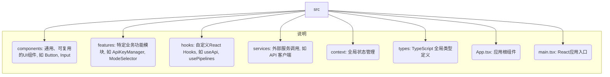

# 项目重构计划

## 1. 背景与问题分析

当前项目虽然使用了 `.tsx` 文件扩展名，但其核心实现并未遵循 React 的组件化和声明式 UI 范式。代码完全通过原生的 `document.getElementById` 和直接的 DOM 操作来构建用户界面和处理逻辑。

主要问题如下：

- **单文件巨石应用**: 超过800行的代码集中在单一文件 (`index.tsx`) 中，混合了 UI、状态管理、API 调用和业务逻辑，难以阅读和维护。
- **紧密耦合**: UI 渲染和业务逻辑紧密耦合，使得代码难以测试、复用和独立修改。
- **全局状态泛滥**: 大量使用全局变量来管理应用状态，容易导致不可预期的副作用和数据流混乱。
- **非响应式 UI**: 手动操作 DOM 来更新 UI 非常繁琐且容易出错，无法利用 React 等现代框架的响应式更新能力。

## 2. 重构目标

本次重构旨在将项目彻底改造为一个现代、健壮且可维护的 React 应用程序。

- **技术栈迁移**: 全面采用 React 和 React-DOM。
- **组件化**: 将 UI 拆分为独立的、可复用的 React 组件。
- **清晰的状态管理**: 引入现代状态管理方案（如 Zustand 或 React Context）来管理应用状态。
- **逻辑分离**: 将业务逻辑、API 调用与 UI 组件分离。
- **提升可维护性**: 建立清晰的项目结构和代码规范。

## 3. 新的项目结构

我们将采用功能驱动的目录结构，以提高模块化和可扩展性。

## 4. 重构实施步骤

重构将分阶段进行，以确保平稳过渡。

- **[ ] 阶段一: 环境搭建与初始化**
    - [ ] 1. 安装必要的依赖: `react`, `react-dom`, `@types/react`, `@types/react-dom`, `@vitejs/plugin-react`。
    - [ ] 2. 配置 `vite.config.ts` 以支持 React。
    - [ ] 3. 创建新的应用入口 `src/main.tsx` 和根组件 `src/App.tsx`。
    - [ ] 4. 更新 `index.html` 以使用新的入口文件。
    - [ ] 5. 将旧的 `index.tsx` 暂时重命名为 `index.legacy.tsx` 以供参考。

- **[ ] 阶段二: 核心功能迁移**
    - [ ] 1. **API密钥管理**: 创建 `features/ApiKeyManager` 组件和 `hooks/useApiKey` Hook。
    - [ ] 2. **状态管理**: 设计并实现核心状态（如 `pipelines`, `currentMode`）的管理方案。
    - [ ] 3. **模式选择**: 创建 `features/ModeSelector` 组件。
    - [ ] 4. **主流程**: 将生成逻辑迁移到 `App.tsx` 中，并由 `GenerateButton` 组件触发。

- **[ ] 阶段三: UI 组件化**
    - [ ] 1. 将 `Prompts Modal` 迁移到 `features/PromptsModal` 组件。
    - [ ] 2. 将 `Diff Modal` 迁移到 `features/DiffModal` 组件。
    - [ ] 3. 将 `Tabs` 和 `Pipeline Display` 迁移到 `features/PipelineView` 组件。

- **[ ] 阶段四: 清理与收尾**
    - [ ] 1. 逐步从 `index.legacy.tsx` 中迁移剩余的逻辑，并最终删除该文件。
    - [ ] 2. 完善代码注释和文档。
    - [ ] 3. 全面测试所有功能。

---

这份文档将作为我们重构工作的纲领。我将根据这个计划，通过 `update_todo_list` 工具来创建和更新我们的任务列表。