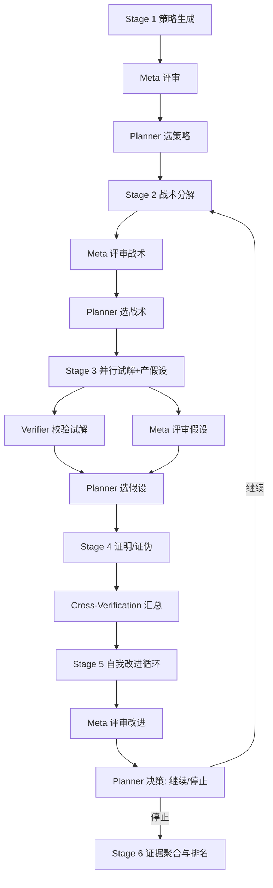

# 反思闭环版对抗性数学工作流架构（V2）

本文档在不修改核心引擎的前提下，为现有工作流引擎提供一套最小侵入、可渐进落地的增强方案，目标：
1) 修复 for_each 被跳过的问题并提升可观测性
2) 在数学工作流中引入系统性反思闭环（Meta/Verifier/Planner/Aggregator），提升稳健性与深度
3) 提供清晰的数据协议、评分与停止准则，便于后续实现与扩展

参考文件与代码入口：
- 引擎执行路径：[`src/core/WorkflowEngine.ts`](src/core/WorkflowEngine.ts)
- 状态管理：[`src/core/StateManager.ts`](src/core/StateManager.ts)
- 工作流类型：[`src/types/workflow.ts`](src/types/workflow.ts)
- 现有数学工作流定义：[`src/workflows/adversarial-math.workflow.json`](src/workflows/adversarial-math.workflow.json)

---

## 1. 问题现状与目标

问题回顾（来源：DEBUG_NOTES）
- 在运行工作流时，含 for_each 的阶段被直接跳过。
- 初步判断问题集中于 [`WorkflowEngine.executeStage()`](src/core/WorkflowEngine.ts:77) 的 JSONPath 取值与上下文结构匹配。

目标
- 短期：提升 for_each 的稳健性与可观测性，避免“静默跳过”
- 中期：以 Schema 约束与路径标准化，保证前后阶段数据连贯
- 长期：在数学工作流中引入反思闭环，形成“评审—修正—再实验”的系统性流程

---

## 2. for_each 稳定性修复与可观测性

### 2.1 统一存储路径与命名
- 引擎已在 [`executeStep`](src/core/WorkflowEngine.ts:116) 中，将任务结果写入：
  - `context.stages[stageId].output[taskId] = result`
- for_each 的 JSONPath 应严格对齐该路径，例如：
  - 第二阶段：`$.stages['stage-1-strategies'].output['task-1.1.1-gen-strategies'].strategies`

### 2.2 输出 Schema 约束（任务产出）
为保证 JSONPath 可定位，约定任务的输出字段命名与结构：

建议标准键名（根据语义）：
- strategies: string[] 或对象数组
- sub_strategies: string[] 或对象数组
- hypotheses: string[] 或对象数组
- solution_trial: { steps: [...], result: string, notes?: string }
- proof_attempt: { outline: string, steps: [...], status: string }
- disproof_attempt: { counterexample?: string, status: string }
- critique: { summary: string, issues: string[], suggestions: string[] }
- scores: { name: string; value: number }[] （区间 [0, 1]）

统一返回对象结构（避免直接返回裸字符串）：
- 每个 Task 输出为对象（object），数组挂载在上述标准键上。
- 如模型输出为字符串 JSON，应在 [`executeTask`](src/core/WorkflowEngine.ts:151) 尝试 JSON.parse（已有），失败则回落为字符串，并由上游 prompt 明确要求返回标准 JSON。

### 2.3 诊断日志与兜底策略（只读规划）
在 [`executeStage`](src/core/WorkflowEngine.ts:77) for_each 分支中增加：

1) 诊断输出（调试级）：
- 打印 `jsonPath` 与 `Array.isArray(items)、typeof、length`
- 打印关键上下文分支（最小必要）：
  - `stages[前一阶段].output[相关taskId]` 子树摘要

2) 非数组兜底：
- 若 `items` 命中单对象且包含唯一数组键（如 strategies/sub_strategies/hypotheses），可自动下钻该键作为迭代数组（打印警告）
- 若命中为单值，则包装为单元素数组（打印警告）

3) 失败提示：
- 当 `items` 为空或未命中，打印“路径未命中 / 命中但非数组”的明确信息，指向建议的标准键名

### 2.4 最小验证用工作流样例（建议）
- Stage-1 产出 strategies（数组）
- Stage-2 for_each strategy in $.stages['stage-1-strategies'].output['task-1.1.1-gen-strategies'].strategies
- Step 内仅一个 echo 任务，将 {{strategy}} 回写输出，便于观测循环行为

---

## 3. 反思闭环增强架构（V2）

### 3.1 新增角色与职责
- meta_reviewer（元评审）：对策略/战术/假设/改进方案进行一致性、覆盖度、可行性评审；产出 critique、scores、prioritized_xxx
- verifier（校验员）：对 solver/prover/disprover 的结论进行形式化/一致性校验；产出 verification_score、issues
- planner（计划修正）：根据 meta 与 verifier 输出，筛选 K/M/Hypotheses；产出 selected_xxx 与下一步参数
- aggregator（聚合者）：整合所有证据、分数、冲突解决记录，生成 final_report（含置信度）

### 3.2 流程编排（摘要）
1. Stage 1: 生成策略 → A1 Meta 评审 → A2 Planner 选前 K 策略
2. Stage 2: 分解战术 → B1 Meta 评审 → B2 Planner 选前 M 战术
3. Stage 3: 并行试解 + 产假设 → C1 Verifier 校验解答 → C2 Meta 评审假设 → C3 Planner 选假设
4. Stage 4: 证明/证伪 → D1 Cross-Verification 汇总与打分（proof vs disproof）
5. Stage 5: 自我改进循环（迭代 L 轮或动态决策）：
   - improver 形成 improved_plan 与 next_actions
   - meta_reviewer 评审改进方案
   - planner 决策继续/停止（若继续，回到 Stage 2/3 子流程）
6. Stage 6: Aggregation 最终报告与排名

### 3.3 Mermaid 概览

注意：Mermaid 方括号中避免使用双引号与圆括号，确保渲染兼容。

---

## 4. 数据协议与选择机制

### 4.1 标准键名与结构（复用 2.2 列表）
- 承上，所有 Task 输出对象化，数组挂载在标准键名上，避免 JSONPath 漂移

### 4.2 评分与选择
- scores: 统一为 [0,1] 浮点；可包含 `{name, value, reason?}`
- prioritized_xxx: [{item, score, reason}]
- selected_xxx: 降维后的入选列表，用于下一阶段 for_each
- planner 的参数：K（策略数）、M（战术数）、H（假设数）、threshold（得分阈值）、budget（并行上限/轮数）

### 4.3 停止准则示例
- 连续两轮 improvement_score 增量 < epsilon
- 冲突比未下降（证明/证伪对立度未收敛）
- verifier 平均分未提升
- 预算耗尽（轮数/代价）

---

## 5. 渐进落地计划

阶段化实施（不改内核或只做极小变更）
1) for_each 稳定性与日志
   - 在引擎插入诊断日志与兜底包装（只读规划）
   - 固化工作流 JSON 的路径与键名
2) 轻量反思步骤
   - 在 Stage 1/2/3 后插入 meta_reviewer 与 planner 的轻量步骤，验证数据可流转
3) 校验与交叉验证
   - 为 Stage 3/4 增加 verifier 与 cross-verification 汇总
4) 自我改进循环
   - 将 Stage 5 设为循环体，引入动态停机逻辑（通过 planner 输出 next_actions/stop_flag）
5) 聚合报告
   - 最后由 aggregator 汇总证据与评分，输出 final_report

---

## 6. UI 与可观察性建议（最小改动）

- 在 [`src/features/WorkflowManager/RealTimeProgressView.tsx:23`](src/features/WorkflowManager/RealTimeProgressView.tsx:23) 增加“Context Snapshot”折叠卡，显示 `context.stages` 的关键分支（仅只读）
- 增加“评分汇总区”：聚合 planner/meta/verifier 的 `scores` 概览
- 标注“关键路径”：根据 planner 的 `selected_*` 在树上高亮经过的节点

---

## 7. 最小可运行验证样例（骨架）

- Stage-1: 生成 strategies（数组），写入：
  - `context.stages['stage-1-strategies'].output['task-1.1.1-gen-strategies'].strategies`
- Stage-2: for_each strategy in `$.stages['stage-1-strategies'].output['task-1.1.1-gen-strategies'].strategies`
  - 任务：将 `{{strategy}}` echo 到输出对象 `{ echoed: "{{strategy}}" }`
- 期望：
  - RealTimeProgressView 可看到 Stage-2 对每个 strategy 产出一条任务记录
  - 调试日志中可见 JSONPath 返回 items 的长度与类型

---

## 8. 风险与权衡

- 若模型输出不稳定（非结构化），需要更严格的提示词约束，强制 JSON 输出（可用示例片段与校验规则）
- 兜底包装虽提高容错，但可能掩盖上游 schema 问题；建议日志中明确标注“已使用兜底”
- 评分/选择机制需要根据实际数据分布做调参（K/M/threshold/epsilon）

---

## 9. 结论

- for_each 问题通过路径对齐、Schema 约束、日志与兜底可快速稳定
- 反思闭环通过最小步骤插入与统一数据协议，能显著提升数学工作流的稳健性与深度
- 建议先以“最小验证样例”验证 for_each 然后逐步引入 Meta/Verifier/Planner/Aggregator，最终实现评分驱动与可解释的闭环推理

本架构文档用于指导后续开发与调试，保持与现有引擎的兼容与低风险演进。